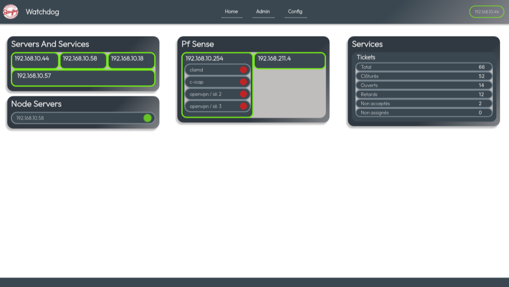

# Node Watchdog



## Description

<div>
    This website is the web interface for the watchdogs for servers, which update its interface in real time.
<br>It indicates the states of numerous services, such as the central server, node servers, and everything that is watched
by the watchdogs.
<br>By default, "OK" services are not displayed, but you can display them by hovering the cell.
<br>In the top right corner, you can see the state of the current central servers.
</div>

### Build With

[![Node.js][node.js]][nodejs-url]
[![TypeScript][ts]][ts-url]
[![NPM][npm]][npm-url]
<br>[![Prisma][prisma]][prisma-url]
[![SocketIO][socketio]][socketio-url]
[![NextJS][nextjs]][nextjs-url]
[![TailwindCSS][tlwdcss]][tlwdcss-url]

## License

[![MIT License][license-shield]](LICENSE)

## Table of Contents

1. [Installation](#installation)
2. [Usage](#usage)
3. [Program structure](#structure)
4. [Improvements](#improvements)
5. [Contributing](#contributing)
6. [License](#license)

<br><a name="installation"></a>
## 1. Installation

Use the version control [git](https://git-scm.com/downloads) to clone the project.

```bash
git clone https://github.com/brandy223/watchdog-website.git
```

<br><a name="usage"></a>
## 2. Usage

Before trying to run, it is necessary to install the dependencies of the project.
<br>To do this, use the NodeJS Package manager [npm](https://www.npmjs.com/get-npm) and run into the project folder:

```bash
# To install the dependencies
npm install
```

Here is the list of the main dependencies of the project:
- [Socket.io](https://www.npmjs.com/package/socket.io)
- [Prisma](https://www.prisma.io/)
- [Ping](https://www.npmjs.com/package/ping)
- [NextJS 13](https://nextjs.org/)
- [TailwindCSS](https://tailwindcss.com/)

Then, to run the project, use the following commands:

```bash
# To run
npm run dev

# To build
npm run build

# And start the build project
npm run start
```

If you want to run it with pm2 (process manager), you can use the following commands:

```bash
# To run
pm2 next dev # exec npm run dev

# or
pm2 next start # exec npm run start (need to build before)
```

But, for the website to really work, you need to configure it. You can go to the 
[configuration documentation](docs/config.md) to do so.

<br><a name="structure"></a>
## 3. Program structure

~~Will come soon~~

<br><a name="improvements"></a>
## 4. Improvements

- [ ] Admin page to add elements to the database easily
- [ ] Configuration page to modify the main config file of all the repositories
- [ ] Notification System
- [ ] Send message to all servers via broadcast to update their config file / database (for example, when adding a new server)
- [ ] Change the system of detection of new data sent by main server (currently, it is a simple interval, but it is not very optimized)
- [ ] Add a route to permit node watchdogs to trigger it when main server is down
- [ ] Hover effect on servers to indicates their ping status (percentage of packet loss)
- [ ] Add last updated time on the categories (servers, services, etc.)

<br><a name="contributing"></a>
## 5. Contributing

Pull requests are welcome. For major changes, please open an issue first
to discuss what you would like to change.

<br><a name="license"></a>
## 6. License

Distributed under the MIT License. See LICENSE for more information.

<!-- MARKDOWN LINKS & IMAGES -->
<!-- https://www.markdownguide.org/basic-syntax/#reference-style-links -->
[license-shield]: https://img.shields.io/github/license/Ileriayo/markdown-badges?style=for-the-badge

[socketio]: https://img.shields.io/badge/Socket.io-black?style=for-the-badge&logo=socket.io&badgeColor=010101
[socketio-url]: https://socket.io/
[prisma]: https://img.shields.io/badge/Prisma-3982CE?style=for-the-badge&logo=Prisma&logoColor=white
[prisma-url]: https://www.prisma.io/
[express]: https://img.shields.io/badge/express.js-%23404d59.svg?style=for-the-badge&logo=express&logoColor=%2361DAFB
[express-url]: https://expressjs.com/fr/
[ts]: https://img.shields.io/badge/TypeScript-007ACC?style=for-the-badge&logo=typescript&logoColor=white
[ts-url]: https://www.typescriptlang.org/
[node.js]: https://img.shields.io/badge/Node.js-339933?style=for-the-badge&logo=node.js&logoColor=white
[node.js_small]: https://img.shields.io/badge/Node.js-339933?style=flat-square&logo=node.js&logoColor=white
[nodejs-url]: https://nodejs.org/
[npm]: https://img.shields.io/badge/npm-CB3837?style=for-the-badge&logo=npm&logoColor=white
[npm_small]: https://img.shields.io/badge/npm-CB3837?style=flat-square&logo=npm&logoColor=white
[npm-url]: https://www.npmjs.com/
[nextjs]: https://img.shields.io/badge/Next-black?style=for-the-badge&logo=next.js&logoColor=white
[nextjs-url]: https://nextjs.org/
[tlwdcss]: https://img.shields.io/badge/tailwindcss-%2338B2AC.svg?style=for-the-badge&logo=tailwind-css&logoColor=white
[tlwdcss-url]: https://tailwindcss.com/